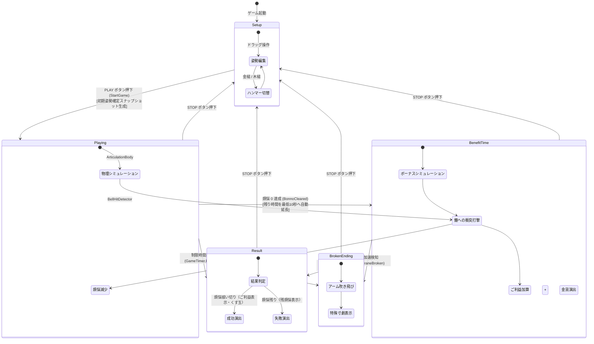
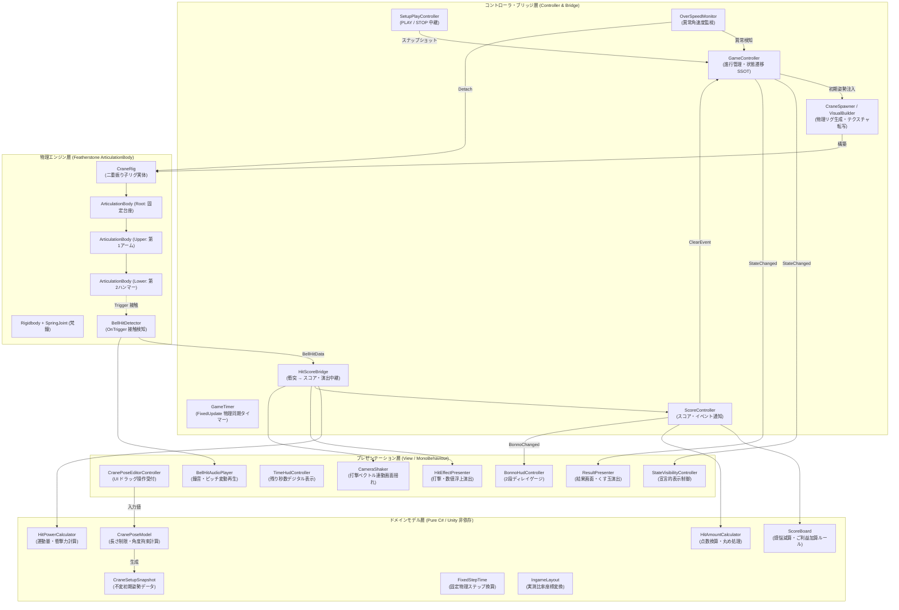
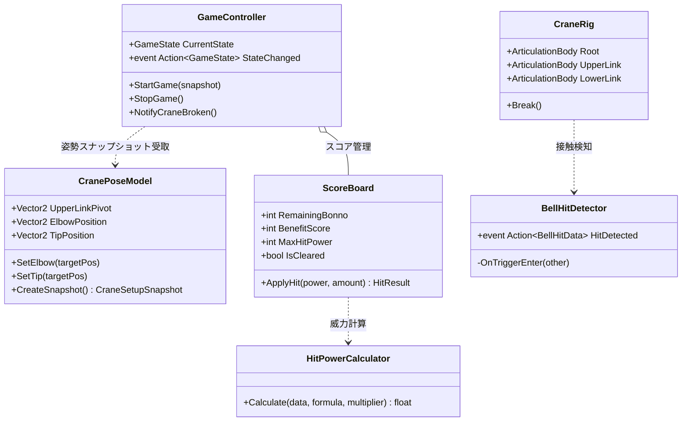
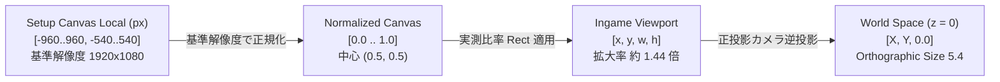
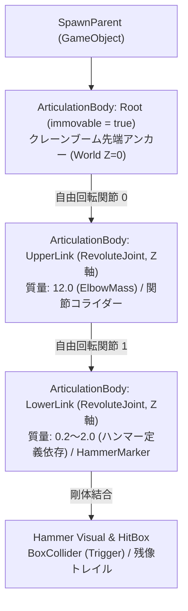
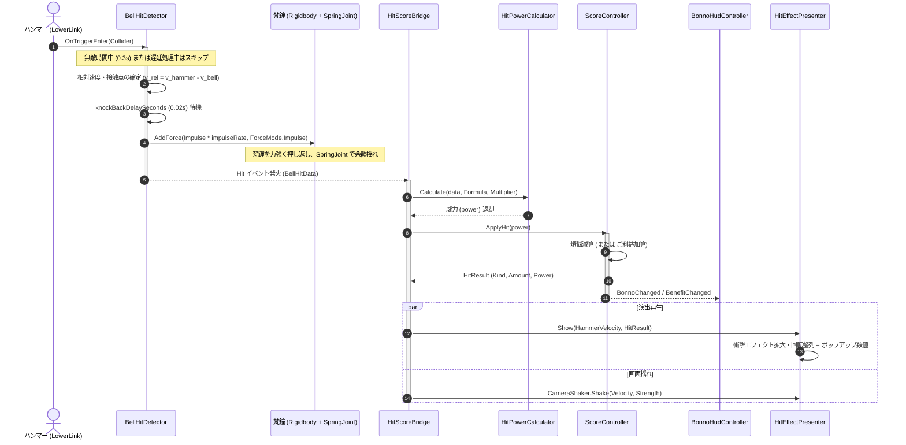
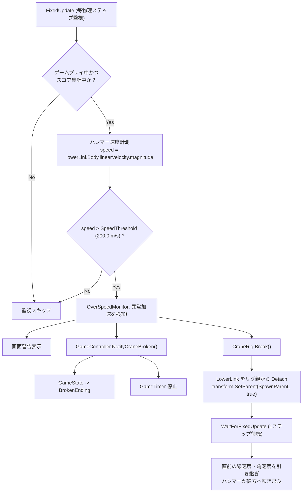
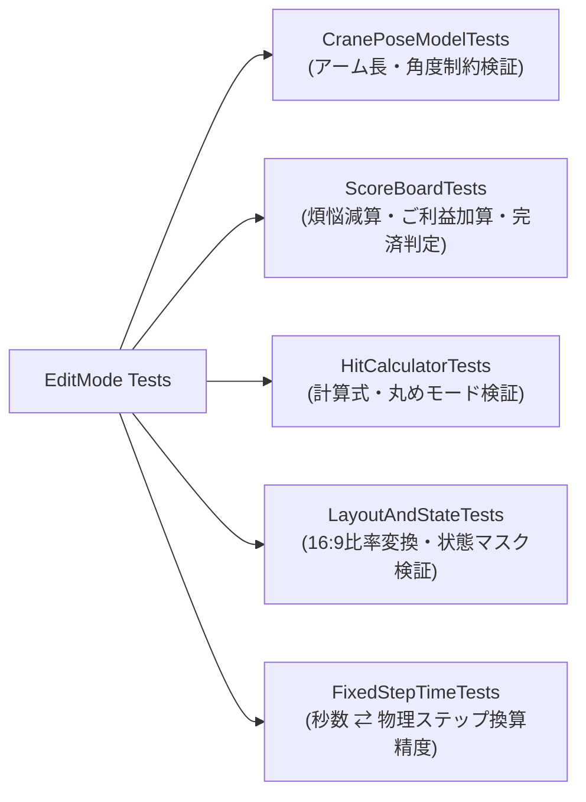

# 坊主がクレーン車で除夜の鐘を叩くゲーム（Crane 再現プロジェクト）


-orange.svg)


Unity の最先端物理エンジン（`ArticulationBody`）を用いて、クレーン車のブームと二重振り子機構によるカオスな振り子運動をシミュレーションし、梵鐘（除夜の鐘）を連打して 108 の煩悩を祓う物理アクションパズルゲームの精密再現プロジェクトです。


---

## 目次 {#table-of-contents}
- [1. プロジェクト概要・ゲームフロー写真](#overview)
- [2. ゲームサイクルとステートマシン](#lifecycle)
- [3. システムアーキテクチャ設計](#architecture)
- [4. 座標変換パイプライン (2D Canvas → 3D Physics)](#coordinates)
- [5. 物理シミュレーションと二重振り子リグ](#physics)
- [6. 衝突判定・衝撃力計算・スコアリング](#scoring)
- [7. 異常加速検知とアーム破壊ギミック](#overspeed)
- [8. UI・演出・フィードバックシステム](#presentation)
- [9. プロジェクト構成・クラスカタログ](#catalog)
- [10. 自動テスト（EditMode Tests）](#testing)
- [11. Doxygen ドキュメント生成](#doxygen)

---

## 1. プロジェクト概要・ゲームフロー写真 {#overview}

### 技術スペック表
| 項目 | 仕様・実装技術 |
| :--- | :--- |
| **開発環境** | Unity 6000.3.22f1 / C# (.NET Standard 2.1) |
| **描画パイプライン** | Universal Render Pipeline (URP) / Orthographic 2D View (16:9 固定) |
| **物理ソルバー** | Featherstone アルゴリズム（`ArticulationBody`）+ PhysX Rigidbody |
| **ゲーム目標** | 制限時間 30 秒以内に 108 の煩悩を祓い、スーパーご利益タイムでハイスコアを獲得 |
| **コアゲーム性** | ミリ単位でクレーンの姿勢を調整し、二重振り子のカオス挙動をコントロールする |

### 実際のゲームプレイ進行（実機録画フレームより抽出）

| 1. 姿勢セットアップ (`Setup`) | 2. 物理スイング・打撃 (`Playing`) | 3. ボーナスタイム (`BenefitTime`) |
| :---: | :---: | :---: |
|  |  |  |
| クレーンアーム角度をミリ単位でドラッグ調整 | 物理演算によるカオス運動で梵鐘を連打 | 煩悩祓い切りで突入、小判が跳ね舞う |

| 4. クリア結果 (`Result - 成功`) | 5. 未クリア結果 (`Result - 失敗`) | 6. 異常加速破壊 (`BrokenEnding`) |
| :---: | :---: | :---: |
|  |  |  |
| くす玉開花・紙吹雪とお祝いメッセージ | 祓えなかった煩悩が表示され反省 | 特定の共振でアームが吹き飛ぶ原作再現 |

---

## 2. ゲームサイクルとステートマシン {#lifecycle}

ゲームの進行は [`GameController`](file:///D:/UnityProject/Crane/Assets/_Game/Scripts/Game/GameController.cs) が単一の真実（SSOT: Single Source of Truth）として集中管理します。外部コンポーネントは状態変更を直接行わず、イベント（`StateChanged`）を購読してリアクティブに振る舞いを切り替えます。



### ステートごとの責務と挙動定義

| ステート名 | 物理演算 | タイマー | ユーザー操作 | 主な振る舞い・演出 |
| :--- | :---: | :---: | :---: | :--- |
| **`Setup`** | 停止 | 30.0s (停止) | アーム・ハンマーのドラッグ調整、ハンマー切り替え | 編集用ギズモとスナップラインを表示。クレーン本体の初期配置。 |
| **`Playing`** | **稼働** | **作動** (減算) | STOP ボタンのみ | 二重振り子が自由落下スイングを開始。梵鐘に衝突するたびに煩悩ゲージが減少。 |
| **`BenefitTime`** | **稼働** | **延長** (最低10s保証) | STOP ボタンのみ | 煩悩完済のボーナスタイム。鐘を叩くたびにご利益（小判）が跳ね飛ぶ。 |
| **`Result`** | 停止 | 0.0s | リトライ (STOPボタン) | 完済時はくす玉とお祝い演出。未完済時は背景がトーンダウンし残煩悩を表示。 |
| **`BrokenEnding`** | **特殊** | 停止 | リトライ (STOPボタン) | 第二リンクが千切れて飛翔。スコア集計を打ち切り、特殊イラストを表示。 |

> [!NOTE]
> すべてのステート変更は [`GameController.SetState()`](file:///D:/UnityProject/Crane/Assets/_Game/Scripts/Game/GameController.cs) を経由し、外部コンポーネントは [`GameState`](file:///D:/UnityProject/Crane/Assets/_Game/Scripts/Game/GameState.cs) enum をキーとする宣言的UIコントローラ（[`StateVisibilityController`](file:///D:/UnityProject/Crane/Assets/_Game/Scripts/Presentation/StateVisibilityController.cs)）によって同期されます。

---

## 3. システムアーキテクチャ設計 {#architecture}

関心の分離（Separation of Concerns: SoC）を徹底し、ドメインロジック（Unity 非依存の純粋な C# クラス）とプレゼンテーション層（MonoBehaviour）を明確に分離しています。



### 主要ドメインクラス図 (Class Diagram)



---

## 4. 座標変換パイプライン (2D Canvas → 3D Physics) {#coordinates}

本作最大の実装的難所の一つが、**「Setup 画面の 2D UI Canvas 上で決めた位置・姿勢」**を、**「Ingame 物理ワールド（3D 空間 z=0 平面）」**へ狂いなくマッピングする独自の変換パイプラインです。

### 空間変換フロー図



### 数学モデルと変換仕様

1. **正規化座標変換**:
   Canvas の基準解像度（$W_{ref}=1920, H_{ref}=1080$）を用いて、ローカル座標 $(x_{local}, y_{local})$ を $[0, 1]$ 区間に正規化します：
   $$x_{norm} = \frac{x_{local}}{W_{ref}} + 0.5, \quad y_{norm} = \frac{y_{local}}{H_{ref}} + 0.5$$

2. **実測比率 Viewport 補正（[`IngameLayout.cs`](file:///D:/UnityProject/Crane/Assets/_Game/Scripts/Data/IngameLayout.cs)）**:
   原作の実測画面比率（画面幅 23.57, 高さ 13.22 に対し Setup 画像幅 33.87, 高さ 18.96, 左オフセット -5.04, 上超過 5.83）に基づき、Viewport 内の描画矩形を正確に計算：
   $$x_{vp} = Rect.x + x_{norm} \times Rect.width$$
   $$y_{vp} = Rect.y + y_{norm} \times Rect.height$$

3. **ワールド座標確定（[`SetupToPhysicsConverter.cs`](file:///D:/UnityProject/Crane/Assets/_Game/Scripts/Physics/SetupToPhysicsConverter.cs)）**:
   正投影カメラ（Orthographic Camera, Size 5.4, 16:9）の `Camera.ViewportToWorldPoint` を介して、ワールド z = 0 平面上の実座標へ展開します。

> [!TIP]
> 編集画面とゲーム画面で解像度アスペクト比が変わっても、[`IngameLayout`](file:///D:/UnityProject/Crane/Assets/_Game/Scripts/Data/IngameLayout.cs) の定数比率によって 16:9 の安全領域が常に数学的に保たれます。

---

## 5. 物理シミュレーションと二重振り子リグ {#physics}

### Featherstone アルゴリズム（`ArticulationBody`）の採用理由

一般的な Unity ゲームで多用される `Rigidbody` + `HingeJoint` は、ペナルティ法や反復インパルスソルバーに基づいているため、以下の二重振り子特有の課題を克服できません：
- ジョイントの伸び（制約ドリフト）
- 数値減衰による不自然な早期停止
- カオス的共振時の発散・吹っ飛び

本作では、ロボット工学の精密なマルチボディ力学計算に用いられる **Featherstone 法（縮約座標系ソルバー）** を実装した **`ArticulationBody`** を採用。エネルギー保存則に極めて近い厳密な積分を行い、二重振り子のリアルな挙動を再現しています。

| 比較項目 | 標準 Rigidbody + HingeJoint | ArticulationBody (本作採用) |
| :--- | :--- | :--- |
| **座標系** | 最大座標系（反復ソルバー制約） | **縮約座標系（Featherstone 法）** |
| **ジョイントの伸び** | 高速回転時に引きちぎれる | **数学的に結合長を完全固定** |
| **エネルギー保存** | 数値減衰が激しくすぐに停止 | **摩擦ゼロで長時間カオス運動を継続** |
| **質量比の安定性** | 根元と先端の質量差に弱い | **大きな質量差（12.0 vs 0.2〜2.0）でも安定** |

### 物理プロファイル設定値（Inspector デフォルト: [`PhysicsProfile.asset`](file:///D:/UnityProject/Crane/Assets/_Game/ScriptableObjects/PhysicsProfile.asset)）

| パラメータ名 | 設定値 | 役割・効果 |
| :--- | :---: | :--- |
| **`ElbowMass`** | **`12.0`** | 第1リンク肘（UpperLink）の質量。二重振り子の慣性モーメントの基準となる。 |
| **`GravityMultiplier`** | **`3.0`** | 重力倍率。[`ArticulationGravityScale`](file:///D:/UnityProject/Crane/Assets/_Game/Scripts/Physics/ArticulationGravityScale.cs) により下向きに $F = m \cdot g \cdot 3.0$ を印加。 |
| **`LinearDamping`** | **`0.0`** | 直線運動減衰（空気抵抗）。完全ゼロに設定しカオス運動を維持。 |
| **`AngularDamping`** | **`0.0`** | 回転運動減衰。完全ゼロに設定し永久スイング挙動を再現。 |
| **`JointFriction`** | **`0.0`** | ジョイント摩擦抵抗。完全ゼロ。 |
| **`SleepThreshold`** | **`0.0`** | スリープ閾値。運動が途中で停止しないよう完全ゼロ化。 |

### リグ階層構造



### ハンマースペック比較（Inspector デフォルト: [`MetalHammer.asset`](file:///D:/UnityProject/Crane/Assets/_Game/ScriptableObjects/MetalHammer.asset) / [`WoodHammer.asset`](file:///D:/UnityProject/Crane/Assets/_Game/ScriptableObjects/WoodHammer.asset)）

| ハンマー種別 | 質量 (`Mass`) | ダメージ倍率 (`DamageBonus`) | 戦略・挙動特性 |
| :--- | :---: | :---: | :--- |
| **金槌 (MetalHammer)** | **`2.0`** | **`0.19`** | 重厚な遠心力で一撃の破壊力が高い。初速をつけるのが難しいが、クリーンヒット時のスコアは圧倒的。 |
| **木槌 (WoodHammer)** | **`0.2`** | **`0.40`** | 超軽量で高速にスイングし、手数で連打を狙うスタイル。遠心力によるコントロールが比較的容易。 |

---

## 6. 衝突判定・衝撃力計算・スコアリング {#scoring}

ハンマーと梵鐘の衝突処理は、物理的な反発演算とゲームロジック（スコア・演出）の双方向処理を行います。



### 威力計算・スコア換算アルゴリズム（Inspector デフォルト: [`HitPowerProfile.asset`](file:///D:/UnityProject/Crane/Assets/_Game/ScriptableObjects/HitPowerProfile.asset) & [`GameSettings.asset`](file:///D:/UnityProject/Crane/Assets/_Game/ScriptableObjects/GameSettings.asset)）

インスペクターで設定されているデフォルト計算式は **`KineticEnergy`（運動エネルギー）** です：

$$\text{RawPower} = \frac{1}{2} m_{hammer} \|\mathbf{v}_{rel}\|^2$$

最終威力値：
$$\text{Power} = \text{RawPower} \times \text{DamageBonus} \times \text{Multiplier} \quad (\text{Multiplier} = 1.0)$$

煩悩・ご利益の減算・加算量換算：
$$\text{Amount} = \lceil \text{Power} \times \text{HitBonnoScoreMultiplier} \rceil \quad (\text{Multiplier} = 0.05, \text{RoundingMode} = \text{Ceil})$$

| 計算式候補 (`HitPowerFormula`) | 数式 | 特徴 |
| :--- | :--- | :--- |
| **`KineticEnergy` (デフォルト)** | $P = \frac{1}{2} m_{hammer} \|\mathbf{v}_{rel}\|^2$ | 速度の2乗に比例し、超高速スイング時の爽快感・爆発力が最大 |
| **`Impulse`** | $P = \|\mathbf{v}_{rel}\| \times \text{ImpulseRate}$ | 物理インパルスに比例する線形計算 |
| **`Momentum`** | $P = m_{hammer} \times \|\mathbf{v}_{rel}\|$ | 質量と速度の積（運動量）による素直な換算 |
| **`RelativeVelocity`** | $P = \|\mathbf{v}_{hammer} - \mathbf{v}_{bell}\|$ | 質量を無視した純粋な相対スイング速度 |
| **`PointVelocity`** | $P = \|\mathbf{v}_{hammer}\|$ | 接触点におけるハンマーの絶対速度 |

### 連続ヒット防止パラメータ（[`GameMain.unity`](file:///D:/UnityProject/Crane/Assets/Scenes/GameMain.unity) / [`BellHitDetector`](file:///D:/UnityProject/Crane/Assets/_Game/Scripts/Bell/BellHitDetector.cs)）
- **押し返し遅延 (`knockBackDelaySeconds`)**: `0.02` 秒（固定ステップ数換算）
- **無敵時間 (`invincibleSeconds`)**: `0.3` 秒（多重ヒット防止）
- **撃力倍率 (`impulseRate`)**: `1.0`

---

## 7. 異常加速検知とアーム破壊ギミック {#overspeed}

原作に存在する「二重振り子の特定の姿勢・共振によって角速度が指数関数的に増大し永久機関化する現象」をゲームの仕様として再現しています。



### 異常加速パラメータ（Inspector デフォルト: [`OverSpeedProfile.asset`](file:///D:/UnityProject/Crane/Assets/_Game/ScriptableObjects/OverSpeedProfile.asset)）
- **アーム破壊速度閾値 (`SpeedThreshold`)**: **`200.0` m/s**

> [!WARNING]
> ハンマーの線速度が 200 m/s を突破すると、第2リンクがジョイントから強制切り離され（Detach）、[`BrokenEnding`](file:///D:/UnityProject/Crane/Assets/_Game/Scripts/Game/GameState.cs) へと遷移してゲームが強制終了します。

---

## 8. UI・演出・フィードバックシステム {#presentation}

### 1. 2段ディレイ追従ゲージ（Inspector デフォルト: [`GameMain.unity`](file:///D:/UnityProject/Crane/Assets/Scenes/GameMain.unity) / [`BonnoHudController`](file:///D:/UnityProject/Crane/Assets/_Game/Scripts/UI/BonnoHudController.cs)）

格闘ゲームのライフゲージのように、打撃の瞬発力と減算の手応えを強調する 2 重スライダー設計：
- **即時ゲージ（手前・水色）**: 打撃が入った瞬間に即時スナップ。
- **遅延ゲージ（奥・赤色）**: **`0.25` 秒**間（`delayedStartSeconds`）その場に留まり、その後 **`0.50` 秒**（`delayedFollowSeconds`）かけて線形補間（Lerp）で追従。

```
打撃直後:
[████████████████░░░░░░░░] ← 奥の遅延ゲージ（0.25秒間ホールド）
[████████████            ] ← 手前の即時ゲージ（即座に減少）

0.5秒後:
[████████████            ] ← 遅延ゲージが手前に追いついて合流
```

### 2. 威力連動プロポーショナルエフェクト（Inspector デフォルト: [`GameSettings.asset`](file:///D:/UnityProject/Crane/Assets/_Game/ScriptableObjects/GameSettings.asset)）

| 演出要素 | Inspector 設定値 | 挙動・スケーリング仕様 |
| :--- | :---: | :--- |
| **打撃スパーク倍率** | 最小 `0.25` 〜 最大 `1.30` | 威力 300 以上（`HitEffectPowerForMaxScale`）で最大サイズ `1.3` に到達。スイングベクトル方向へ自動回転。 |
| **数値ポップアップ** | フォントサイズ `150` / 倍率 `1.5` | 浮上距離 `1.0`、表示時間 `1.0` 秒で上空へ浮上しながらイージングフェードアウト。 |
| **画面揺れ** | 継続 `0.25`s / 振幅 `0.08`〜`0.30` / 周波数 `12` | [`CameraShaker`](file:///D:/UnityProject/Crane/Assets/_Game/Scripts/Presentation/CameraShaker.cs) が打撃ベクトルの向きへカメラを押し出し、減衰バネ振動。 |
| **小判シャワー** | 威力連動枚数 | `BenefitTime` 中のヒットで、威力に応じた枚数の金貨（BouncingBenefit）が画面中に飛び散る。 |

### 3. セットアップエディタ設定（Inspector デフォルト: [`CranePoseEditorData.asset`](file:///D:/UnityProject/Crane/Assets/_Game/ScriptableObjects/CranePoseEditorData.asset)）

| パラメータ名 | 設定値 | 役割 |
| :--- | :---: | :--- |
| **`ReferenceResolution`** | `1920 × 1080` | Canvas 基準解像度 |
| **`BoomMinAngle` / `BoomMaxAngle`** | `110.57°` 〜 `145.13°` | クレーンブームの起伏角度可動範囲 |
| **`BoomMaxAngularSpeed`** | `45.0°/s` | ブームの最大回転角速度 |
| **`BoomThickness` / `LinkThickness`** | `72 px` / `28 px` | ブーム・アームの描画太さ |
| **`HammerSize`** | `150 × 82 px` | ハンマーの当たり判定矩形サイズ |

---

## 9. プロジェクト構成・クラスカタログ {#catalog}

```
Crane/
├── Assets/_Game/
│   ├── Images/                   # ゲーム用スプライト・テクスチャ・UIアセット
│   ├── ScriptableObjects/        # 各種プロファイル・Inspector設定アセット
│   ├── Scripts/
│   │   ├── Bell/                 # 梵鐘・衝突検知・打撃計算・音響
│   │   ├── Common/               # 共通ユーティリティ・実行順序・固定ステップ時間
│   │   ├── Data/                 # データ定義・レイアウト定数
│   │   ├── Game/                 # ゲーム進行ステートマシン・タイマー
│   │   ├── Hammer/               # ハンマー定義
│   │   ├── Physics/              # ArticulationBody リグ構築・スポーン・異常監視
│   │   ├── Presentation/         # 演出・カメラ揺れ・レイアウト・描画順
│   │   ├── Score/                # 煩悩・ご利益の集計ドメインモデル
│   │   ├── Setup/                # 姿勢エディタ・ドラッグ操作・UIモデル
│   │   └── UI/                   # HUD・タイマー・リザルト演出
│   └── Tests/
│       └── EditMode/             # 純粋ロジックの単体テストスイート
└── Docs/
    └── Images/                   # ドキュメント用画像（実機録画フレーム切り出し写真）
```

### 主要クラス一覧

| クラス名 | レイヤー | 主要責務 |
| :--- | :---: | :--- |
| [`GameController`](file:///D:/UnityProject/Crane/Assets/_Game/Scripts/Game/GameController.cs) | Controller | ゲーム全体のステートマシン・進行イベント発行（SSOT） |
| [`GameTimer`](file:///D:/UnityProject/Crane/Assets/_Game/Scripts/Game/GameTimer.cs) | Controller | 物理ステップ数準拠のカウントダウンタイマー |
| [`CranePoseModel`](file:///D:/UnityProject/Crane/Assets/_Game/Scripts/Setup/CranePoseModel.cs) | Domain | 姿勢編集の純粋計算モデル（リンク長拘束・角度制限） |
| [`CranePoseEditorController`](file:///D:/UnityProject/Crane/Assets/_Game/Scripts/Setup/CranePoseEditorController.cs) | View | UI ドラッグ入力の受付と RectTransform へのリアルタイム反映 |
| [`SetupToPhysicsConverter`](file:///D:/UnityProject/Crane/Assets/_Game/Scripts/Physics/SetupToPhysicsConverter.cs) | Bridge | Setup Canvas 座標から 3D ワールド座標への精密マッピング |
| [`CraneRigBuilder`](file:///D:/UnityProject/Crane/Assets/_Game/Scripts/Physics/CraneRigBuilder.cs) | Physics | `ArticulationBody` による二重振り子物理階層の構築 |
| [`CraneRigVisualBuilder`](file:///D:/UnityProject/Crane/Assets/_Game/Scripts/Physics/CraneRigVisualBuilder.cs) | Physics | UI スプライトの物理リグへの精密テクスチャ転写 |
| [`OverSpeedMonitor`](file:///D:/UnityProject/Crane/Assets/_Game/Scripts/Physics/OverSpeedMonitor.cs) | Physics | 第二リンクの角速度監視とアーム破壊トリガー |
| [`BellHitDetector`](file:///D:/UnityProject/Crane/Assets/_Game/Scripts/Bell/BellHitDetector.cs) | Physics | 梵鐘トリガー検知・相対速度測定・撃力付与 |
| [`HitPowerCalculator`](file:///D:/UnityProject/Crane/Assets/_Game/Scripts/Bell/HitPowerCalculator.cs) | Domain | 撃力・運動エネルギー・運動量からの威力計算 |
| [`ScoreBoard`](file:///D:/UnityProject/Crane/Assets/_Game/Scripts/Score/ScoreBoard.cs) | Domain | 煩悩・ご利益の集計ドメインモデル |
| [`ScoreController`](file:///D:/UnityProject/Crane/Assets/_Game/Scripts/Score/ScoreController.cs) | Controller | スコア集計の Unity ライフサイクル管理とイベント通知 |
| [`BonnoHudController`](file:///D:/UnityProject/Crane/Assets/_Game/Scripts/UI/BonnoHudController.cs) | View | 2段ディレイゲージと残り煩悩/ご利益の表示 |
| [`StateVisibilityController`](file:///D:/UnityProject/Crane/Assets/_Game/Scripts/Presentation/StateVisibilityController.cs) | View | 宣言的ルールに基づく表示・非表示の一括制御 |

---

## 10. 自動テスト（EditMode Tests） {#testing}

Unity Test Framework（EditMode）により、Unity エディタの再生を待つことなくミリ秒単位で網羅的な単体テストを実行できます。



| テストファイル | テスト対象・検証内容 |
| :--- | :--- |
| [`CranePoseModelTests.cs`](file:///D:/UnityProject/Crane/Assets/_Game/Tests/EditMode/CranePoseModelTests.cs) | リンク最小長拘束、角度リミット、ドラッグ当たり判定 |
| [`ScoreBoardTests.cs`](file:///D:/UnityProject/Crane/Assets/_Game/Tests/EditMode/ScoreBoardTests.cs) | 煩悩減算、ご利益加算、オーバーキル非繰越、最大威力記録 |
| [`HitCalculatorTests.cs`](file:///D:/UnityProject/Crane/Assets/_Game/Tests/EditMode/HitCalculatorTests.cs) | 各計算式（撃力/速度/運動エネルギー）と丸めモードの検証 |
| [`LayoutAndStateTests.cs`](file:///D:/UnityProject/Crane/Assets/_Game/Tests/EditMode/LayoutAndStateTests.cs) | Viewport座標変換比率、16:9均等スケーリング、状態マスク |
| [`FixedStepTimeTests.cs`](file:///D:/UnityProject/Crane/Assets/_Game/Tests/EditMode/FixedStepTimeTests.cs) | 秒数 ⇄ 物理ステップ数の四捨五入換算精度 |

### テスト実行方法
Unity エディタのメニュー `Window` > `General` > `Test Runner` を開き、`EditMode` タブから `Run All` を実行します。

---

## 11. Doxygen ドキュメント生成 {#doxygen}

本プロジェクトの C# ソースコードは、すべての主要クラス・メソッドに Doxygen 準拠の XML ドキュメンテーションコメントが付与されています。

### ドキュメント生成手順
プロジェクトのルートディレクトリで以下のコマンドを実行します：
```bash
doxygen Doxyfile
```

実行後、`Docs/Doxygen/html/index.html` をブラウザで開くことで、本 README をトップページとした完全な API リファレンス、クラス継承図、コラボレーション図を閲覧できます。
