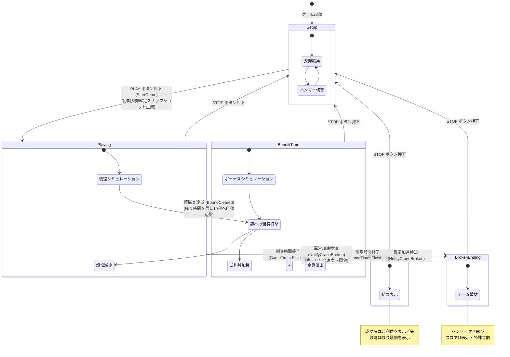
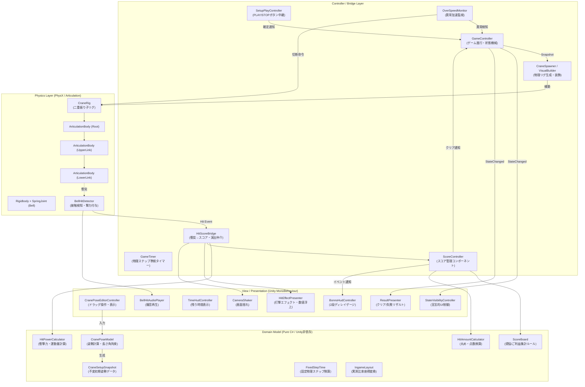
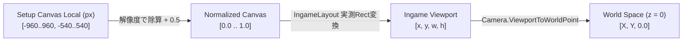
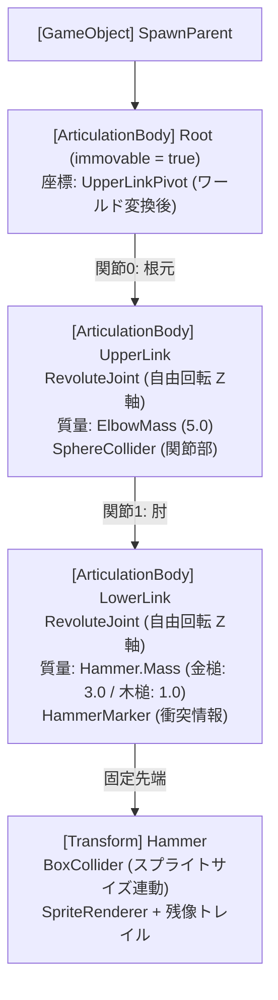
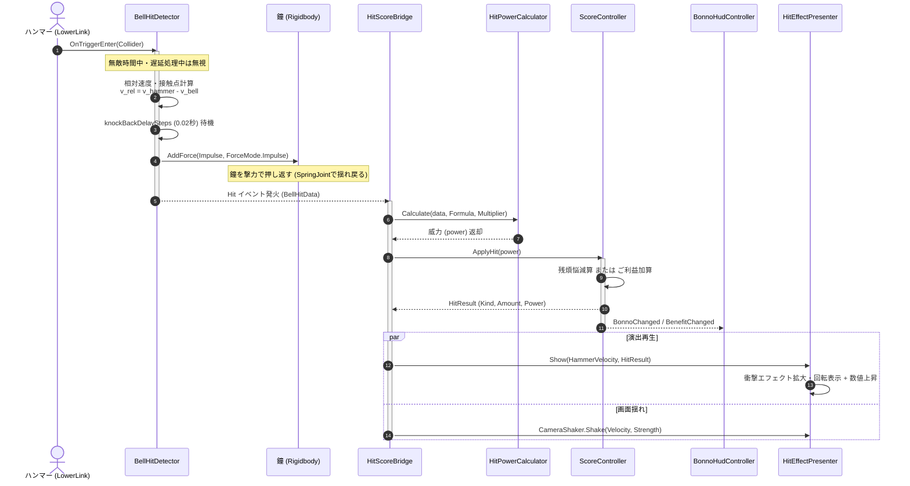
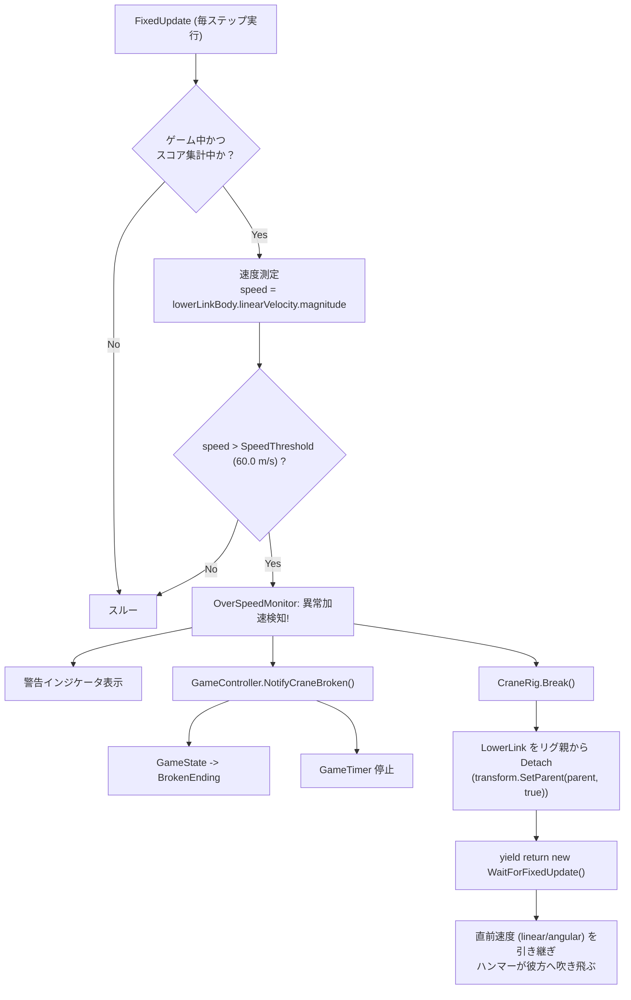

# 坊主がクレーン車で除夜の鐘を叩くゲーム（Crane 再現プロジェクト）

Unity 物理エンジン（`ArticulationBody`）を用いて、クレーン車のブームと二重振り子機構によるカオスな振り子運動をシミュレーションし、梵鐘（除夜の鐘）を連打して煩悩を祓う物理アクションパズルゲームの精密再現プロジェクトです。

---

## 目次 {#table-of-contents}
- [1. プロジェクト概要](#overview)
- [2. ゲームサイクルとステートマシン](#lifecycle)
- [3. システムアーキテクチャ設計](#architecture)
- [4. 座標変換パイプライン](#coordinates)
- [5. 物理シミュレーションと二重振り子リグ](#physics)
- [6. 衝突判定・衝撃力計算・スコアリング](#scoring)
- [7. 異常加速検知とアーム破壊ギミック](#overspeed)
- [8. UI・演出・フィードバックシステム](#presentation)
- [9. プロジェクト構成・クラスカタログ](#catalog)
- [10. 自動テスト（EditMode Tests）](#testing)
- [11. Doxygen ドキュメント生成](#doxygen)

---

## 1. プロジェクト概要 {#overview}

| 項目 | 内容 |
| :--- | :--- |
| **開発環境** | Unity 6000.3.22f1 / C# (.NET Standard 2.1) |
| **レンダリング** | Universal Render Pipeline (URP) / Orthographic 2D View (16:9 固定) |
| **物理ソルバー** | Featherstone アルゴリズム（`ArticulationBody`）+ PhysX Rigidbody |
| **ゲーム目的** | 制限時間 30 秒以内に 108 の煩悩を祓い切り、スーパーご利益タイムでハイスコアを獲得する |
| **コア体験** | クレーン姿勢をミリ単位で調整して「PLAY」を押し、カオスな二重振り子の挙動を見守る |

---

## 2. ゲームサイクルとステートマシン {#lifecycle}

ゲームの進行は [`GameController`](Assets/_Game/Scripts/Game/GameController.cs) が単一の真実（SSOT: Single Source of Truth）として集中管理します。外部コンポーネントは状態変更を直接行わず、イベント（`StateChanged`）を購読してリアクティブに振る舞いを切り替えます。

### 状態遷移図（State Diagram）



### 各状態の責務定義
- **`Setup`**: クレーンのブーム角度、第1リンク・第2リンクの姿勢、ハンマーの種類（金槌/木槌）をドラッグ操作で設定する待機状態。
- **`Playing`**: 物理演算が作動し、鐘を叩いて煩悩（初期値 108）を減算していく標準ゲーム状態。
- **`BenefitTime`**: 煩悩をすべて祓った後のボーナス状態。制限時間が最低秒数（10秒）まで保障・延長され、叩くたびにご利益が加算される。
- **`Result`**: タイムアップ時の結果画面。クリア（ご利益表示）または未クリア（残煩悩表示＆背景グレーアウト）を表示。
- **`BrokenEnding`**: 原作の「永久機関バグ」をリスペクトした特殊ルート。異常加速によってアームが千切れ飛び、スコア集計を打ち切る。

---

## 3. システムアーキテクチャ設計 {#architecture}

関心の分離（Separation of Concerns）を徹底し、ドメインロジック（純粋な C# クラス）と Unity プレゼンテーション層（MonoBehaviour）を明確に分離しています。

### アーキテクチャ構成図



---

## 4. 座標変換パイプライン {#coordinates}

本作は、**「Setup 画面の 2D UI Canvas 上で決めた位置・姿勢」**を、**「Ingame 物理ワールド（3D 空間 z=0 平面）」**へ狂いなくマッピングする独自の変換パイプラインを持っています。

### 座標変換フロー



### 数学モデルと変換仕様
1. **正規化座標変換**:
   ```
   NormalizedPoint = (LocalPosition.x / ReferenceResolution.x + 0.5,
                      LocalPosition.y / ReferenceResolution.y + 0.5)
   ```
2. **Viewport 変換（[`IngameLayout.cs`](Assets/_Game/Scripts/Data/IngameLayout.cs)）**:
   原作の実測比率（画面幅 23.57, 高さ 13.22 に対し Setup 画像幅 33.87, 高さ 18.96, 左オフセット -5.04, 上超過 5.83）に基づき、Viewport 内の描画矩形（拡大率 約 1.44 倍）を計算：
   ```
   ViewportPoint.x = SetupImageViewportRect.x + NormalizedPoint.x * SetupImageViewportRect.width
   ViewportPoint.y = SetupImageViewportRect.y + NormalizedPoint.y * SetupImageViewportRect.height
   ```
3. **ワールド座標変換（[`SetupToPhysicsConverter.cs`](Assets/_Game/Scripts/Physics/SetupToPhysicsConverter.cs)）**:
   正投影カメラ（Orthographic Camera, Size 5.4, 16:9）の `ViewportToWorldPoint` を介してワールド z = 0 平面上の実座標を確定します。

---

## 5. 物理シミュレーションと二重振り子リグ {#physics}

### なぜ `ArticulationBody` なのか？
一般的な Unity の `Rigidbody` + `HingeJoint` による多体系物理では、反復ソルバーによる制約ドリフトや数値減衰により、振り子の運動エネルギーが短時間で散逸し停止してしまいます。
本作ではロボット工学向けの Featherstone 法に基づく縮約座標系ソルバー **`ArticulationBody`** を採用し、運動方程式の厳密な積分によって二重振り子特有のカオス的挙動とエネルギー保存を再現しています。

### リグ階層構造



### 物理パラメータ設定値（[`PhysicsProfile.cs`](Assets/_Game/Scripts/Data/PhysicsProfile.cs)）
- **`JointType`**: `RevoluteJoint`（Z軸中心自由回転、`twistLock = FreeMotion`）
- **`LinearDamping`**: `0.01` / **`AngularDamping`**: `0.01`（減衰を極小化）
- **`JointFriction`**: `0.0`（関節摩擦ゼロ）
- **`GravityMultiplier`**: `1.0`（[`ArticulationGravityScale`](Assets/_Game/Scripts/Physics/ArticulationGravityScale.cs) により `FixedUpdate` 毎に `F = m * g * multiplier` を印加）

### ハンマー定義（[`HammerDefinition.cs`](Assets/_Game/Scripts/Hammer/HammerDefinition.cs)）
| ハンマー種別 | 質量 (`Mass`) | ダメージ倍率 (`DamageBonus`) | 特徴 |
| :--- | :---: | :---: | :--- |
| **金槌 (Kin)** | `3.0` | `1.0` | 先端が重く、振り子の遠心力と一撃の破壊力が極めて高い |
| **木槌/丸太 (Maruta)** | `1.0` | `0.6` | 軽量で高速にスイングし、手数で攻めるスタイル |

---

## 6. 衝突判定・衝撃力計算・スコアリング {#scoring}

ハンマーと梵鐘の衝突処理は、物理的な反発演算とゲームロジック（スコア・演出）の双方向処理を行います。

### 衝突・打撃シーケンス図（Sequence Diagram）



### 威力計算アルゴリズム（[`HitPowerFormula.cs`](Assets/_Game/Scripts/Bell/HitPowerFormula.cs)）
計算式は設定により切替可能（デフォルト: `Impulse`）：
- **`Impulse`**: `P = |v_relative| * ImpulseRate`
- **`RelativeVelocity`**: `P = |v_hammer - v_bell|`
- **`Momentum`**: `P = m_hammer * |v_relative|`
- **`KineticEnergy`**: `P = 0.5 * m_hammer * |v_relative|^2`
- **`PointVelocity`**: `P = |v_hammer|`

最終威力計算：
```
Power = RawPower * DamageBonus * Multiplier
```

### 連続ヒット防止（決定性の担保）
- **押し返し遅延**: 接触から 0.02 秒（[`FixedStepTime`](Assets/_Game/Scripts/Common/FixedStepTime.cs) で固定ステップ数換算）後に撃力を印加。
- **無敵時間**: ヒット成立後 0.3 秒間は新規接触を受け付けず、1 回のスイングで多重カウントされる現象を防止。

---

## 7. 異常加速検知とアーム破壊ギミック {#overspeed}

原作に存在する「二重振り子の特定の姿勢・共振によって角速度が指数関数的に増大し永久機関化する現象」をゲームの仕様として再現しています。



---

## 8. UI・演出・フィードバックシステム {#presentation}

### 1. 2段ディレイ追従ゲージ（[`BonnoHudController.cs`](Assets/_Game/Scripts/UI/BonnoHudController.cs)）
ダメージの手応えを強調するため、格闘ゲームのライフゲージに似た 2 重スライダー機構を搭載：
- **メインゲージ（手前）**: 打撃瞬間に即座に減算値へスナップ。
- **遅れゲージ（奥）**: 0.25 秒間停止した後、0.5 秒かけて線形補間（Lerp）でメインゲージへ追いつく。

```
打撃直後:
[████████████████░░░░░░░░] ← 奥の遅延ゲージ（残る）
[████████████            ] ← 手前の即時ゲージ
```

### 2. 威力連動型プロポーショナルエフェクト
打撃威力に応じて以下のパラメータが動的にスケール：
- **打撃エフェクト倍率**: 最小 0.25 倍 〜 最大 0.50 倍（威力 300 以上で最大）
- **エフェクト回転**: ハンマーの進行ベクトル方向に自動整列
- **フォントサイズ**: ラベル比 1.5 倍で数値が拡大表示され、上空へ浮上しながらフェード
- **画面揺れ**: 打撃ベクトルの向きにカメラをオフセットし、減衰振動

### 3. 宣言的状態表示制御（[`StateVisibilityController.cs`](Assets/_Game/Scripts/Presentation/StateVisibilityController.cs)）
コード内に `if (state == ...)` を乱立させず、Inspector 上のテーブル定義で各 GameObject の表示・非表示およびコンポーネント有効化を一括制御します。

---

## 9. プロジェクト構成・クラスカタログ {#catalog}

```
Assets/_Game/
├── Scripts/
│   ├── Bell/                 # 梵鐘・衝突検知・打撃計算
│   ├── Common/               # 共通ユーティリティ・実行順・固定時間
│   ├── Data/                 # ScriptableObject・レイアウト定数
│   ├── Game/                 # ゲーム進行・ステートマシン・タイマー
│   ├── Hammer/               # ハンマー定義アセット
│   ├── Physics/              # ArticulationBody リグ構築・スポーン・異常監視
│   ├── Presentation/         # 演出・カメラ揺れ・レイアウト・描画順
│   ├── Score/                # 煩悩・ご利益の集計ロジック
│   ├── Setup/                # 姿勢エディタ・ドラッグ操作・UIモデル
│   └── UI/                   # HUD・タイマー表示・リザルト演出
└── Tests/
    └── EditMode/             # 純粋ロジックの単体テスト群
```

### 主要スクリプト一覧

| 名前空間 / クラス | 主要責務 | 関連ファイル |
| :--- | :--- | :--- |
| **`Crane.Game.GameController`** | ゲーム全体のステートマシン・進行イベント発行 | [`GameController.cs`](Assets/_Game/Scripts/Game/GameController.cs) |
| **`Crane.Game.GameTimer`** | 物理ステップ数準拠のカウントダウンタイマー | [`GameTimer.cs`](Assets/_Game/Scripts/Game/GameTimer.cs) |
| **`Crane.Setup.CranePoseModel`** | 姿勢編集の純粋計算モデル（リンク長拘束・角度制限） | [`CranePoseModel.cs`](Assets/_Game/Scripts/Setup/CranePoseModel.cs) |
| **`Crane.Setup.CranePoseEditorController`** | UI ドラッグ入力の受付と RectTransform への反映 | [`CranePoseEditorController.cs`](Assets/_Game/Scripts/Setup/CranePoseEditorController.cs) |
| **`Crane.PhysicsSim.SetupToPhysicsConverter`** | Setup Canvas 座標から 3D ワールド座標への精密変換 | [`SetupToPhysicsConverter.cs`](Assets/_Game/Scripts/Physics/SetupToPhysicsConverter.cs) |
| **`Crane.PhysicsSim.CraneRigBuilder`** | `ArticulationBody` による二重振り子物理階層の構築 | [`CraneRigBuilder.cs`](Assets/_Game/Scripts/Physics/CraneRigBuilder.cs) |
| **`Crane.PhysicsSim.CraneRigVisualBuilder`** | UI スプライトの物理リグへの精密テクスチャ転写 | [`CraneRigVisualBuilder.cs`](Assets/_Game/Scripts/Physics/CraneRigVisualBuilder.cs) |
| **`Crane.PhysicsSim.OverSpeedMonitor`** | 第二リンクの速度監視とアーム破壊トリガー | [`OverSpeedMonitor.cs`](Assets/_Game/Scripts/Physics/OverSpeedMonitor.cs) |
| **`Crane.Bell.BellHitDetector`** | 梵鐘トリガー検知・相対速度測定・撃力付与 | [`BellHitDetector.cs`](Assets/_Game/Scripts/Bell/BellHitDetector.cs) |
| **`Crane.Bell.HitPowerCalculator`** | 撃力・運動エネルギー・運動量からの威力計算 | [`HitPowerCalculator.cs`](Assets/_Game/Scripts/Bell/HitPowerCalculator.cs) |
| **`Crane.Score.ScoreBoard`** | 煩悩・ご利益の集計ドメインモデル | [`ScoreBoard.cs`](Assets/_Game/Scripts/Score/ScoreBoard.cs) |
| **`Crane.Score.ScoreController`** | スコア集計の Unity ライフサイクル管理とイベント通知 | [`ScoreController.cs`](Assets/_Game/Scripts/Score/ScoreController.cs) |
| **`Crane.UI.BonnoHudController`** | 2段ディレイゲージと残り煩悩/ご利益の表示 | [`BonnoHudController.cs`](Assets/_Game/Scripts/UI/BonnoHudController.cs) |
| **`Crane.Presentation.StateVisibilityController`** | 宣言的ルールに基づく表示・非表示の一括制御 | [`StateVisibilityController.cs`](Assets/_Game/Scripts/Presentation/StateVisibilityController.cs) |

---

## 10. 自動テスト（EditMode Tests） {#testing}

Unity Test Framework（EditMode）により、Unity エディタの再生を行わずに高速かつ網羅的な単体テストを実行できます。

```
Assets/_Game/Tests/EditMode/
├── CranePoseModelTests.cs   # リンク最小長拘束、角度リミット、ドラッグ当たり判定
├── ScoreBoardTests.cs       # 煩悩減算、ご利益加算、オーバーキル非繰越、最大威力記録
├── HitCalculatorTests.cs    # 各計算式（撃力/速度/運動エネルギー）と丸めモードの検証
├── LayoutAndStateTests.cs   # Viewport座標変換比率、16:9均等スケーリング、状態マスク
└── FixedStepTimeTests.cs    # 秒数 ⇄ 物理ステップ数の四捨五入換算精度
```

テスト実行方法:
Unity エディタのメニュー `Window` > `General` > `Test Runner` を開き、`EditMode` タブから `Run All` を実行します。

---

## 11. Doxygen ドキュメント生成 {#doxygen}

本リポジトリは Doxygen に完全準拠したドキュメンテーションコメント（XML ドキュメント形式）が記述されています。

### ドキュメントビルド手順
リポジトリのルートディレクトリで以下のコマンドを実行します：
```bash
doxygen Doxyfile
```
生成された `Docs/Doxygen/html/index.html` をブラウザで開くことで、本 README をトップページとしたクラスリファレンス、継承グラフ、コラボレーション図を閲覧できます。
